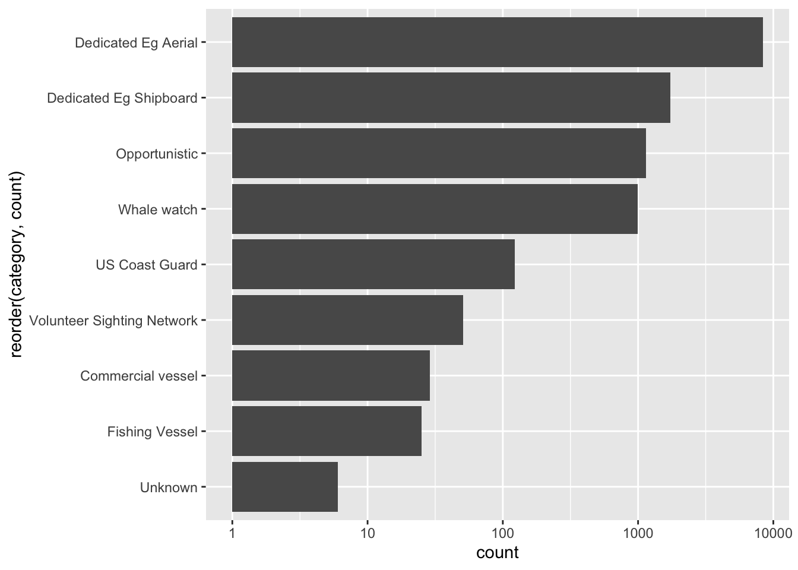
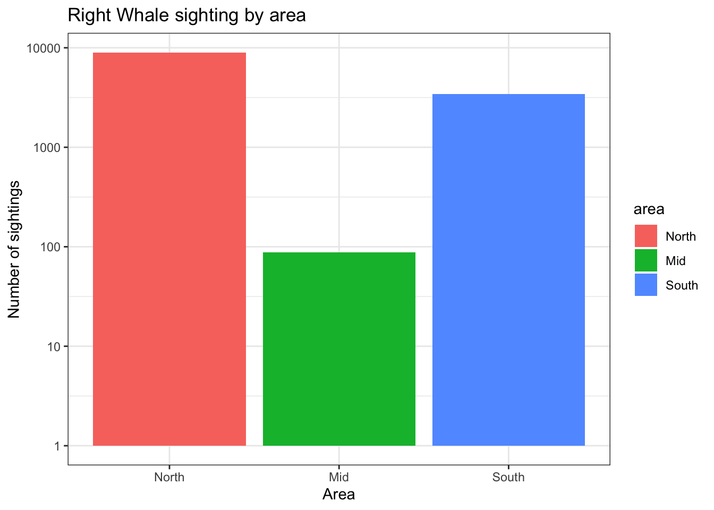
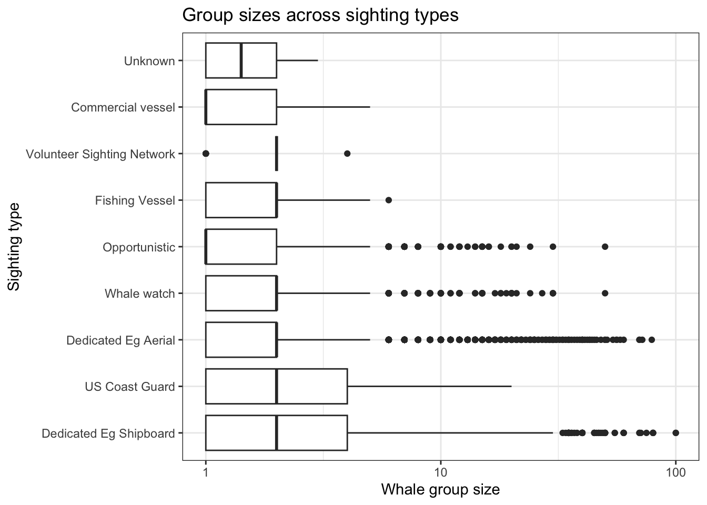
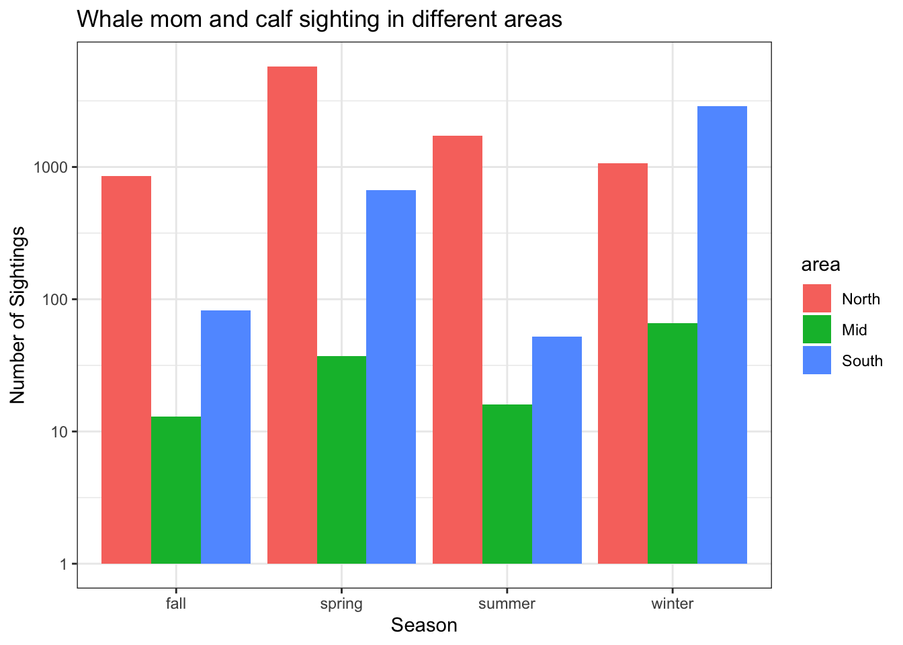
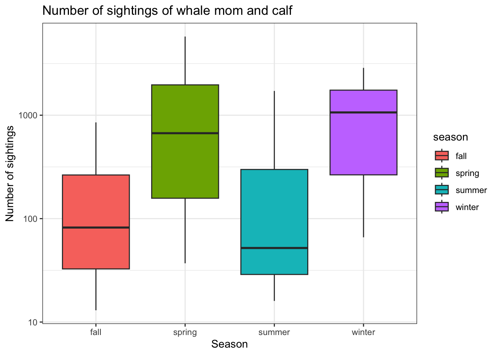
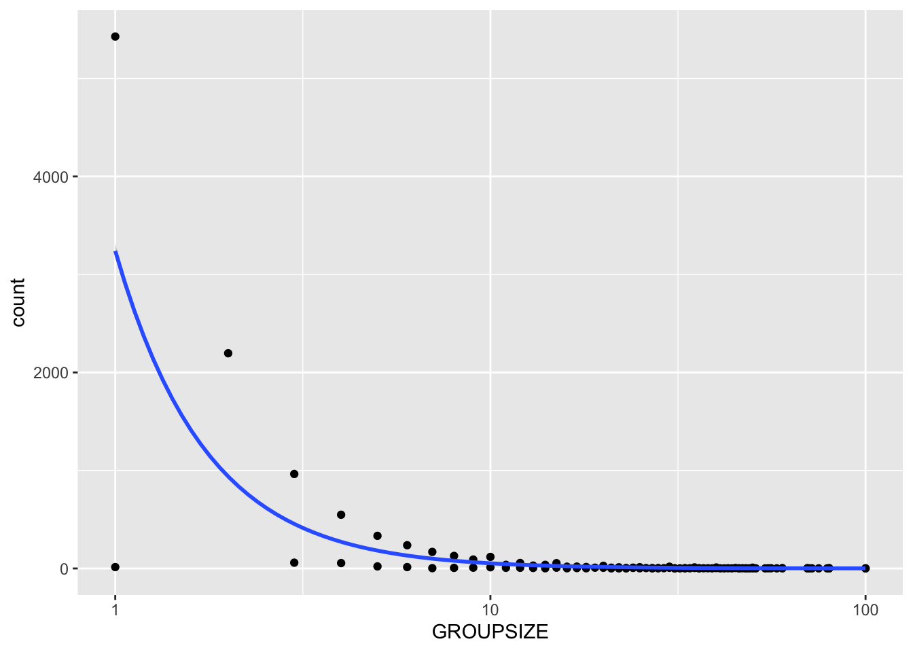

# Data Description
In this example project, I have taken the dataset "Right Whale Sightings Advisory System (RWSAS), from NOAA. This fishery program was designed to reduce ship collisions with critically endangered North Atlantic right whales. This dataset includes information on Whale ID, sighting date, group size, latitude, longitude, certainty on sighting, category of sighting, presence of whale mom and calf, and duplicates in the dataset. 

# Research Question 
Where are the North Atlantic Right Whales most frequently seen, and does group size vary across sighting types?

# Data Cleaning 
For data hygiene, I removed variables from the dataset that were not relevant to this analysis in order to streamline the data and reduce potential sources of error. I also checked for and excluded duplicate records to ensure data quality. Latitude values were then grouped into three regional categories: North, Mid, and South. Finally, sighting dates for the mother-calf data were converted into seasonal groupings to support temporal comparisons.

# Results
### Number of whale sighting at different observation platforms
Dedicated research vessels, especially aerial surveys, appears to be the most effective method for detecting whales. This might be the reason as they cover large areas efficiently. It is shown that survey efforts and platform types influence sighting frequency (Figure 1). 

### Number of whale sighting in each area
By dividing the latitude and longititude by North, Mid, and South. Whale sightings are seen to be more significant in the North. (Figure 2)

### Group size across sighting types
Small whale groups are the most commonly observed throughout all observing platforms, generally 1-3 whales per group. Aerial surveys tend to detect larger aggregations of whale groups as they have the ability to scan bigger areas from a birds eye view. On the other hand, observation platforms such as Dedicated Egg Shipboard and US Coast Guard sighting show a larger variability and wider ranges in group size (Figure 3). After running an ANOVA and Tukey test, the Tukey post-hoc tests showed that group size differed significantly between several sighting category, espescially between opportunistic sightings and dedicated survery categories (p < 0.05).

### Whale mom and calf sightings
With whale mom and calf sightings within the groups, there is a seasonal shift in where wightings are most concentrated, where in the North, mom and calf sightings peaks in spring, and in the South it peaks during Winter. Between North and South (categorized as Mid in this study), whale mom and calf sighting remains low throughout (Figure 4). Overall, Spring season is shown to have the most whale mom and calf sightings (Figure 5). 

### Relationship between mother-calf sightings and group size
Mother-calf pairs are most commonly observed in small groups, or in isolated pairs, rather than in bigger groups sizes. This may reflect whale behavior, where mothers with calves avoid larger grouch to reduce competition and stress (Figure 6).

# Data visualization
## Number of whale sighting at different observation platforms

Figure 1. Bar graph shows the amount of right whale sightings at different sighting types.  

## Number of whale sighting in each area

Figure 2. Bar graph showing the number of right whale sightings in different areas, categorized by North (pink), Mid (green), and South (blue), based on the area. 

## Group size across sighting types

Figure 3. Boxplot showing the whale group size seen at different sighting types.

## Whale mom and calf sightings

Figure 4. Bargraph showing right whale mom and calf sightings throughout different seasons at different areas, categorized as North (pink), Mid (green), and South (blue).

## Relationship between mother-calf sightings and group size

Figure 5. Boxplot showing the number of sightings of whale mom and calf across all seasons.  

## Relationship between mother-calf sightings and group size

Figure 6. Scatterplot showing the relationship between whale mother-calf sightings and group size.

 

